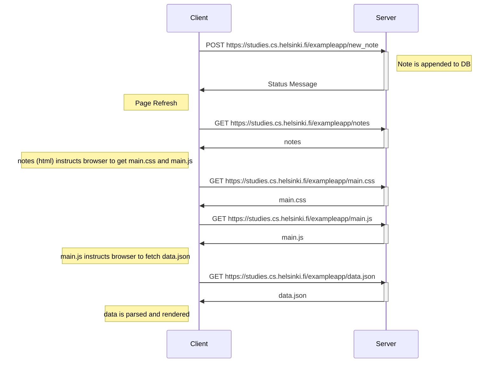

```mermaid
sequenceDiagram
    participant Client
    participant Server

    Client->>Server: POST https://studies.cs.helsinki.fi/exampleapp/new_note
    activate Server
    note right of Server: Note is appended to DB
    Server->>Client: Status Message
    deactivate Server
    Note left of Client: Page Refresh
    Client->>Server: GET https://studies.cs.helsinki.fi/exampleapp/notes
    activate Server
    Server->>Client: notes
    deactivate Server

    Note left of Client: notes (html) instructs browser to get main.css and main.js
    Client->>Server: GET https://studies.cs.helsinki.fi/exampleapp/main.css
    activate Server
    Server->>Client: main.css
    deactivate Server

    Client->>Server: GET https://studies.cs.helsinki.fi/exampleapp/main.js
    activate Server
    Server->>Client: main.js
    deactivate Server

    Note left of Client: main.js instructs browser to fetch data.json
    Client->>Server: GET https://studies.cs.helsinki.fi/exampleapp/data.json
    activate Server
    Server->>Client: data.json
    deactivate Server
    Note left of Client: data is parsed and rendered
```