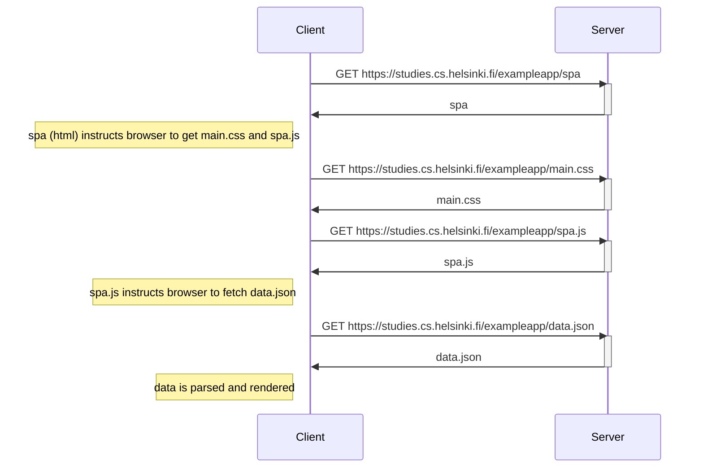

```mermaid
sequenceDiagram
    participant Client
    participant Server

    Client->>Server: GET https://studies.cs.helsinki.fi/exampleapp/spa
    activate Server
    Server->> Client: spa
    deactivate Server
    note left of Client: spa (html) instructs browser to get main.css and spa.js

    Client->>Server: GET https://studies.cs.helsinki.fi/exampleapp/main.css
    activate Server
    Server->> Client: main.css
    deactivate Server

    Client->>Server: GET https://studies.cs.helsinki.fi/exampleapp/spa.js
    activate Server
    Server->> Client: spa.js
    deactivate Server
    note left of Client: spa.js instructs browser to fetch data.json

    Client->>Server: GET https://studies.cs.helsinki.fi/exampleapp/data.json
    activate Server
    Server->> Client: data.json
    deactivate Server
    note left of Client: data is parsed and rendered
```